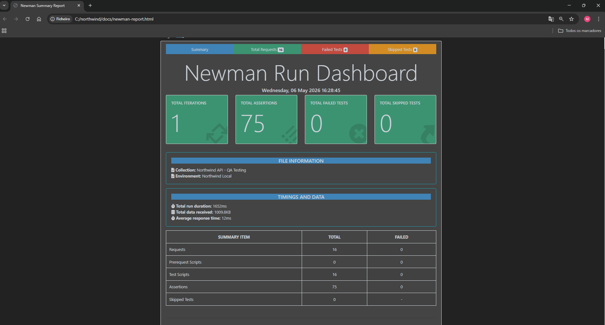
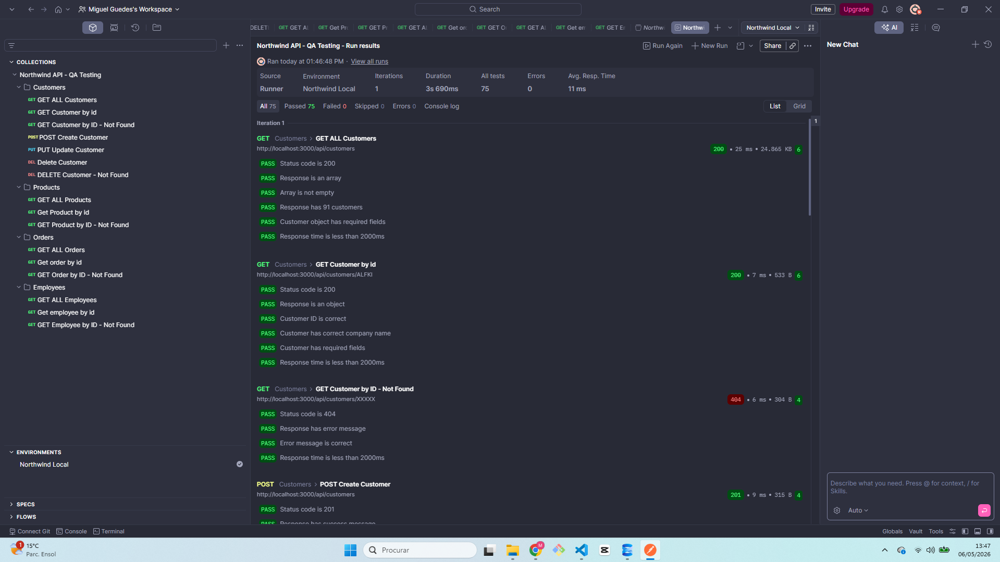
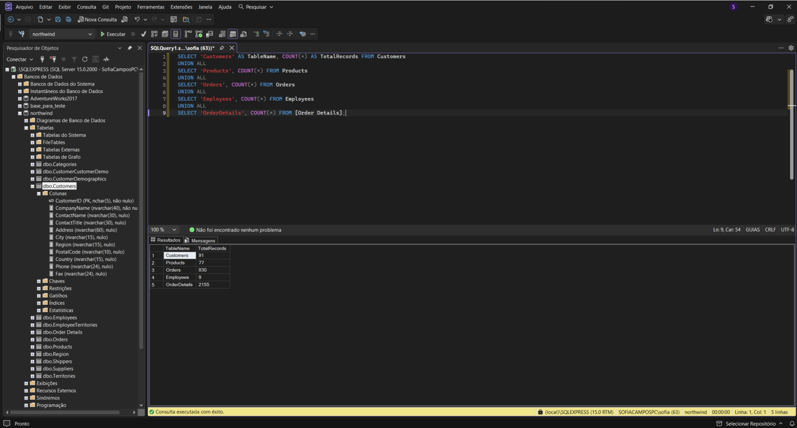
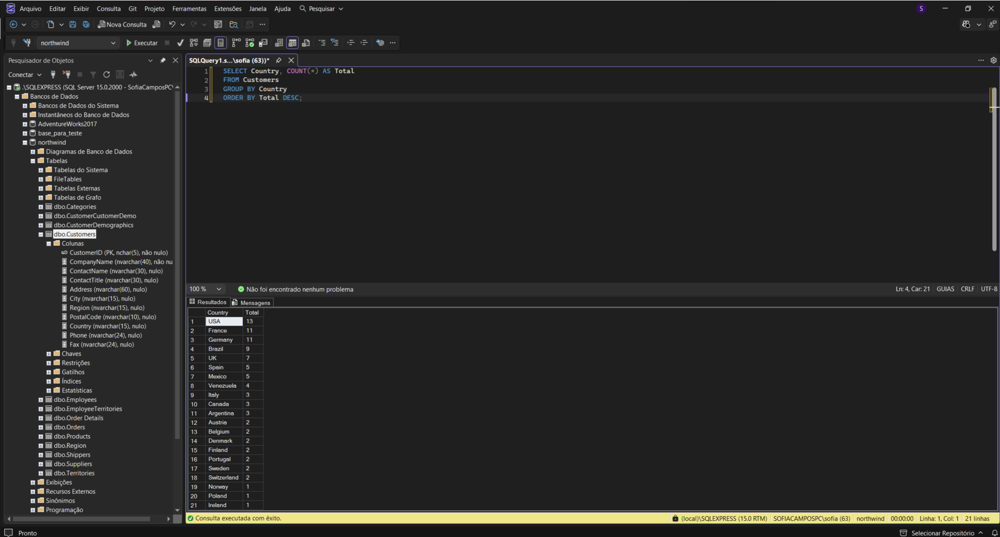
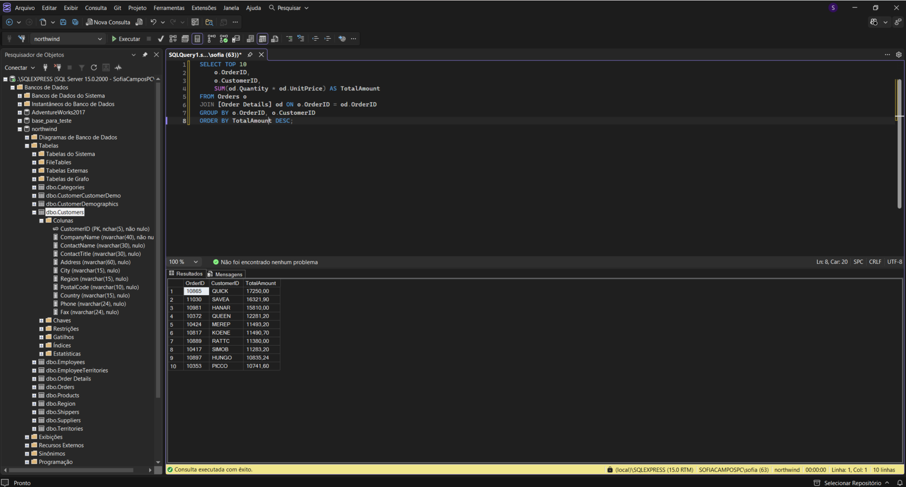

# 🧪 Northwind API — QA Testing Project


A professional QA testing project built on top of the classic **Northwind** database.  
This project covers **REST API testing**, **test automation**, and **database validation** using industry-standard tools.

---

## 📌 Project Overview

This project demonstrates a full QA testing cycle on a custom-built REST API connected to the **Northwind SQL Server** database.  
The goal was to design, execute, and document a professional test suite covering positive scenarios, negative scenarios, and database-level validation.

---

## 🛠️ Tech Stack

| Layer | Technology |
|---|---|
| API | Node.js + Express |
| Database | Microsoft SQL Server Express 2019 |
| API Testing | Postman + Newman |
| Test Automation | Cypress |
| DB Validation | SSMS + SQL Queries |
| Reporting | Newman HTMLExtra + Mochawesome |
| Version Control | Git + GitHub |

---

## 🏗️ Project Architecture

northwind-qa-project/
├── src/
│   └── server.js              # REST API (Node.js + Express)
├── cypress/
│   └── e2e/
│       ├── customers.cy.js    # Customers automated tests
│       ├── employees.cy.js    # Employees automated tests
│       └── orders.cy.js       # Orders automated tests
├── postman/
│   ├── northwind-collection.json    # Postman collection
│   └── northwind-environment.json  # Postman environment
├── sql/
│   └── queries-validation.sql      # SQL validation queries
├── docs/
│   ├── postman-screenshots/        # Postman & Newman reports
│   ├── cypress/                    # Cypress reports & screenshots
│   └── sql-screenshots/            # SQL validation screenshots
├── .env.example
├── .gitignore
└── README.md


---

## 🔌 API Endpoints

The REST API was built from scratch using **Node.js + Express**, connected to the **Northwind SQL Server** database.

| Method | Endpoint | Description |
|---|---|---|
| GET | `/api/customers` | Get all customers |
| GET | `/api/customers/:id` | Get customer by ID |
| POST | `/api/customers` | Create new customer |
| PUT | `/api/customers/:id` | Update customer |
| DELETE | `/api/customers/:id` | Delete customer |
| GET | `/api/products` | Get all products |
| GET | `/api/products/:id` | Get product by ID |
| GET | `/api/orders` | Get all orders |
| GET | `/api/orders/:id` | Get order by ID |
| GET | `/api/employees` | Get all employees |
| GET | `/api/employees/:id` | Get employee by ID |

---

## 📬 Postman Testing

A complete Postman collection was built with **16 requests** covering all endpoints.  
Each request includes multiple assertions validating status codes, response structure, data integrity, and response time.

### Test Coverage

| Folder | Requests | Tests |
|---|---|---|
| Customers | 7 | 30 |
| Products | 3 | 14 |
| Orders | 3 | 13 |
| Employees | 3 | 18 |
| **Total** | **16** | **75** |

### Test Types
- ✅ Status code validation (200, 201, 404)
- ✅ Response body structure validation
- ✅ Data integrity checks
- ✅ Response time validation (< 2000ms)
- ✅ Positive scenarios
- ✅ Negative scenarios (invalid IDs, not found)

### Newman Report — 75/75 Passed





---

## 🤖 Cypress Automation

API tests were automated using **Cypress** with `cy.request()`, covering the same scenarios as Postman but in a fully automated pipeline.

### Results

| Spec | Tests | Status |
|---|---|---|
| customers.cy.js | 7 | ✅ Passed |
| employees.cy.js | 3 | ✅ Passed |
| orders.cy.js | 3 | ✅ Passed |
| **Total** | **13** | **✅ All Passed** |

### Run all tests
```bash
npx cypress run
```

### Cypress Reports

![Customers Report] 01 - (docs/cypress/cypress_report_screenshots/customers01-cypress-report.png)

![Customers Report] 02 - (docs/cypress/cypress_report_screenshots/customers02-cypress-report.png)

![Employees Report] 01 - (docs/cypress/cypress_report_screenshots/employees-cypress-report.png)

![Orders Report] 01 - (docs/cypress/cypress_report_screenshots/orders-cypress-report.png)


---

## 🗄️ Database Validation (SQL Server)

All API operations were validated directly in the **Northwind SQL Server** database using SSMS.

### Validation Queries

```sql
-- Database overview
SELECT 'Customers' AS TableName, COUNT(*) AS TotalRecords FROM Customers
UNION ALL
SELECT 'Products', COUNT(*) FROM Products
UNION ALL
SELECT 'Orders', COUNT(*) FROM Orders
UNION ALL
SELECT 'Employees', COUNT(*) FROM Employees;

-- Validate created customer
SELECT * FROM Customers WHERE CustomerID = 'TESTE';

-- Top sales by order
SELECT TOP 10
    o.OrderID,
    o.CustomerID,
    SUM(od.Quantity * od.UnitPrice) AS TotalAmount
FROM Orders o
JOIN [Order Details] od ON o.OrderID = od.OrderID
GROUP BY o.OrderID, o.CustomerID
ORDER BY TotalAmount DESC;
```

### SQL Screenshots








---

## 🚀 How to Run This Project

### Prerequisites
- Node.js v18+
- Microsoft SQL Server Express 2019
- Northwind database installed
- Postman (optional)

### 1. Clone the repository
```bash
git clone https://github.com/MiguelGuedes1/northwind-api-qa-testing.git
cd northwind-api-qa-testing
```

### 2. Install dependencies
```bash
npm install
```

### 3. Configure environment
Create a `.env` file based on `.env.example`:
```env
DB_SERVER=localhost\SQLEXPRESS
DB_DATABASE=northwind
DB_USER=sa
DB_PASSWORD=your_password
PORT=3000
```

### 4. Start the API
```bash
npm start
```

### 5. Run Cypress tests
```bash
npx cypress run
```

### 6. Generate Newman report
```bash
newman run postman/northwind-collection.json -e postman/northwind-environment.json -r htmlextra --reporter-htmlextra-export docs/newman-report.html
```

---

## 📊 Test Results Summary

| Tool | Tests | Passed | Failed |
|---|---|---|---|
| Postman/Newman | 75 | 75 | 0 |
| Cypress | 13 | 13 | 0 |
| **Total** | **88** | **88** | **0** |

---

## 👨‍💻 Author

**Miguel Guedes**  
QA Tester | Porto, Portugal  
[GitHub](https://github.com/MiguelGuedes1) · [LinkedIn](https://www.linkedin.com/in/miguel-guedes)

---

## 📄 License

This project is for educational and portfolio purposes.
